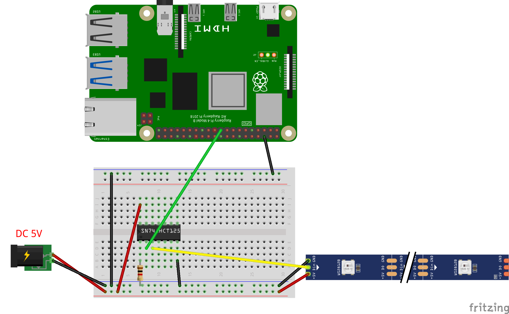
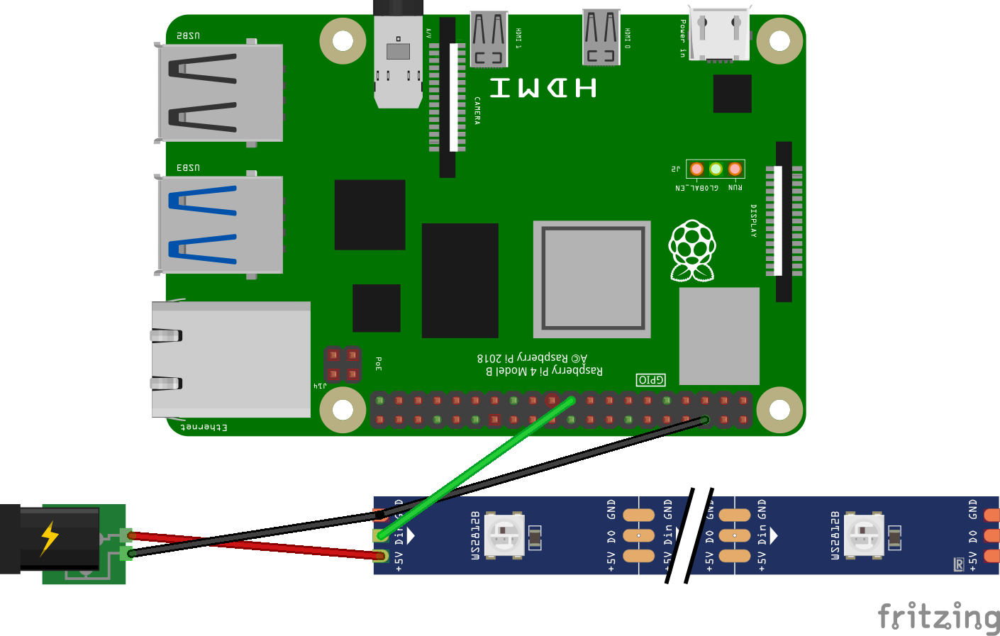

# RGB Led Strip

Raspberry Pi package for controlling addressable RGB LED Strip on **WS281x chip** (Neopixel) written in Julia. 

*NOTE! This package should be considered alpha. Not all features are implemented. But basically it works.*

[](https://GitHub.com/metelkin/LEDStrip.jl/issues/)
[](https://github.com/metelkin/LEDStrip.jl/blob/master/LICENSE)

## Introduction

The addressable RGB LED strip, which are based on **WS281x chip** or similar, is popular for different education and DIY projects.
It allows controlling the each pixel of strip and creating a nice colored show. On the [YouTube you can find examples](https://www.youtube.com/results?search_query=addressable+led+strip+raspberry+pi) how [Raspberry Pi](https://www.raspberrypi.org/) can be used for it.

This is a Julia's package for LED strip control which is based on [BaremetalPi.jl](https://github.com/ronisbr/BaremetalPi.jl) engine.

## Installation

1. You need Raspberry Pi with the default OS installed.
    I tested on Raspberry Pi 4 (Raspberry Pi OS 32bit) but it should be working with other Raspberry versions and OS.
1. SPI protocol should be turn on, see OS settings.
1. In other tutorials it is also recommended to set frequency in the file `/boot/config.txt` as follows
    ```txt
    core_freq=500
    core_freq_min=500

    # spidev.bufsiz=32768 # if default SPI buffer too small
    ```
1. Julia should be installed on Raspberry Pi. 
    I have tested on v1.1.0 which can be installed with
    ```sh
    sudo apt update
    sudo apt install julia
    ```

1. The package can be installed as usual (from Julia env):

    ```julia
    ] add https://github.com/metelkin/LEDStrip.jl.git
    ```

1. Circuits

    **A.** LED strip can be connected based on the following scheme.
    If the 3.3V signal is not enough for RGB Strip DIN a chip transforming 3.3V to 5V logic may be required. I used **SN74AHCT125N** chip.
    

    **B.** In many cases LED Strips can work with 3.3V output signal. In that case the chip is not required.
    

## Usage

"Hello World!" example

```julia
using LEDStrip

# use main SPI MOSI connector is GPIO10
# total pixels count is 100
s = SPIStrip(0; pixel_count = 100) 

# set pixels 1, 2, 3, 4 as red, green, blue, white
# for 5 seconds, then off
set_pixels!(s, [0xff0000, 0x00ff00, 0x00ff00, 0xffffff]) # update buffer
show_pixels(s) # show buffered colors
sleep(5.)
hide_pixels(s) # hide all colors
```

You can also clone the repository and use test cases.

```sh
julia --project=. test/run.jl
```

## Video demo
[](https://youtu.be/0c5QVqN6y7E)

## Known issues and limitations

Currently only SPI is supported via GPIO10 and GPIO20.
PWM and PCM protocols can be potentially used as well.

### TODO list

- [x] SPI, pins: GPIO10 or GPIO20
- [ ] soft PWM, pins: any?
- [ ] hard PWM (interfering with analog audio)
- [ ] PCM (interfering with digital audio)

## Related projects

- C library with connectors to Python and other languages (but not Julia)
    <https://github.com/jgarff/rpi_ws281x>
- NodeJS package
    https://www.npmjs.com/package/rpi-ws281x


## License

Published under [MIT License](LICENSE)
