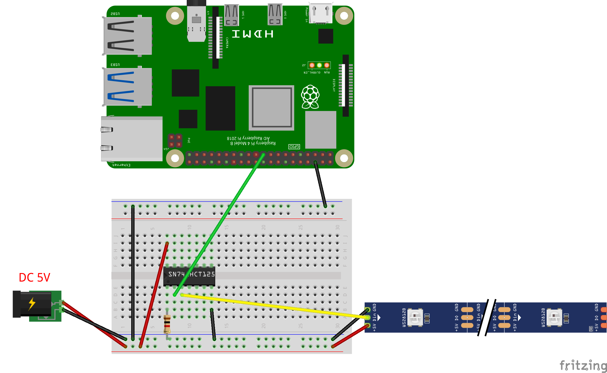

# LEDStrip.jl package

Raspberry Pi package for controlling addressable RGB LED Strip on **WS281x chip** (Neopixel) written in Julia. 

## Introduction

The addressable RGB LED strip, which are based on **WS281x chip** or similar, is popular for different education and DIY projects.
It allows controlling the each pixel of strip and creating a nice colored show. On the [YouTube you can find examples](https://www.youtube.com/results?search_query=addressable+led+strip+raspberry+pi) how [Raspberry Pi](https://www.raspberrypi.org/) can be used for it.

This is a Julia's package for LED strip control which is based on [BaremetalPi.jl](https://github.com/ronisbr/BaremetalPi.jl) engine.

## Installation

Julia must be installed on Raspberry Pi. 
I have tested on v1.1.0 which can be installed with:
```sh
sudo apt update
sudo apt install julia
```

The package can be installed from Julia environment with:

```julia
] add https://github.com/metelkin/LEDStrip.jl.git
```

### Notes

I have tested on RaspberryPi 4 with the [Raspberry Pi OS](https://www.raspberrypi.org/software/operating-systems/#raspberry-pi-os-32-bit) installed.
It seems it should work it should be working with other Raspberry versions and OS.

SPI protocol should be turn on, see OS settings.

In other tutorials it is also recommended to set frequency in the file `/boot/config.txt` as follows
```txt
core_freq=500
core_freq_min=500
```

In older versions of RasperryPi one should extend the SPI buffer size in `/boot/config.txt`.
```txt
# spidev.bufsiz=32768 # if default SPI buffer too small
```

See also the notes in other projects like here: <https://github.com/jgarff/rpi_ws281x>

## Circuits

### A.

LED strip can be connected based on the following scheme.
RaspberryPi's 5V output is not enough as power for RGB LEd Strip. Use external power source.

In many cases LED Strips can work with 3.3V output signal.
In that case you need no additional chip elements.


### B.

If the 3.3V signal is not enough for RGB Strip DIN a chip transforming 3.3V to 5V logic may be required. You can use **SN74AHCT125N** chip or similar.


## Usage

You can work with LEd pixels directly or using the internal `LEDStrip` buffer.

```julia
using LEDStrip

# use main SPI MOSI connector is GPIO10
# total pixels count is 100
s = SPIStrip(1; pixel_count = 100) 

### Direct approach ###

# set pixels 1, 2, 3, 4 as red, green, blue, white
send_colors(s, [0xff0000, 0x00ff00, 0x00ff00, 0xffffff])
# clear pixels (set them black)
send_colors(s, [0x000000, 0x000000, 0x000000, 0x000000])

### Using buffer ###

# set pixels 1, 2, 3, 4 as red, green, blue, white
# for 5 seconds
set_pixels!(s, [0xff0000, 0x00ff00, 0x00ff00, 0xffffff]) # update buffer
show_pixels(s) # show buffered colors
sleep(5.)
# hide 
hide_pixels(s) # hide all colors
sleep(5.)
# show again
show_pixels(s) # show buffered colors
```

## Video demo
[](https://youtu.be/0c5QVqN6y7E)

## Known issues and limitations

Currently only SPI is supported via GPIO10 and GPIO20.
PWM and PCM protocols can be potentially supported in future versions.

## Related projects

- C library with connectors to Python and other languages (but not Julia)
    <https://github.com/jgarff/rpi_ws281x>
- NodeJS package
    https://www.npmjs.com/package/rpi-ws281x
